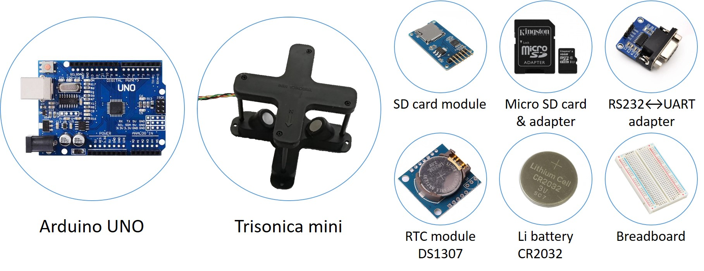

# Anemometer_reader
Case file #001 : Anemometer reader, RTC &amp; SD card logger @NTUAS

## Description
Save a record of following contents to attached SD card every sampling time interval.  
(1) Standard time (YYYY/MM/DD hour:min:sec) provided by an RTC (Real Time Clock) module.  
(2) Sensor readings from the "Trisonica Mini" anemometer.  

## Materials
  
### Arduino UNO  
### Anemometer "Trisonica Mini"  
- Operating voltage 12 VDC.  
- Communication protocol RS232.  
### DS1307 Real time clock module  
- Communication protocol I2C.
### Micro SD card adapter module  
- Communication protocol SPI.
### Peripherals  
- RS232-UART adapter.
- Lithium battery CR2032.

## Wiring diagram

## Current results
RTC time information successfully logged to SD card. See LOG.txt.  
Synchronous serial monitor display demonstrated in screenshot below.  

